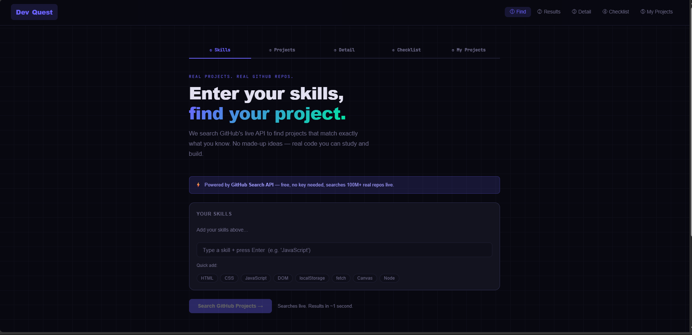
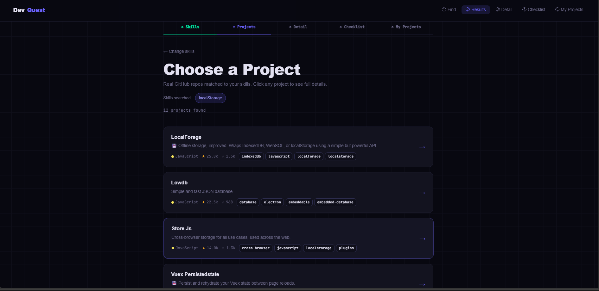
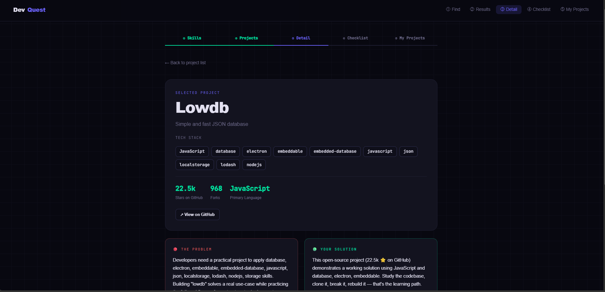
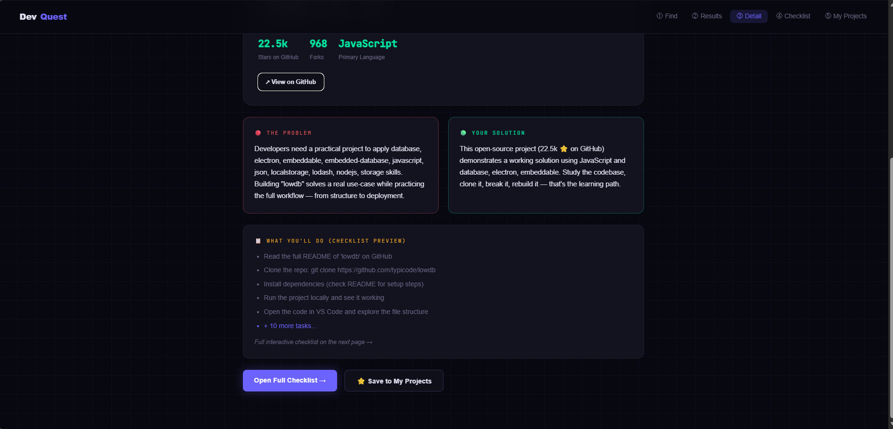
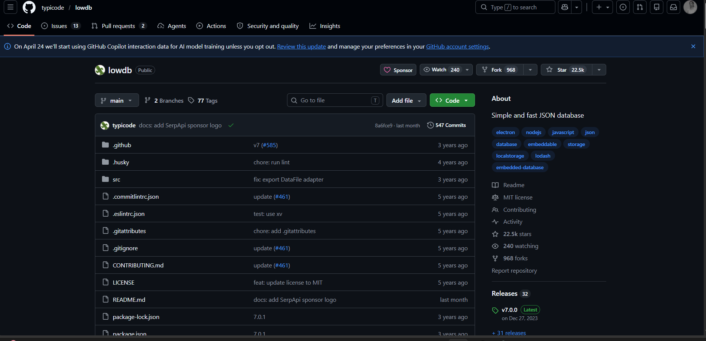
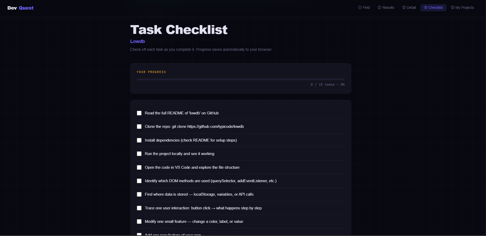
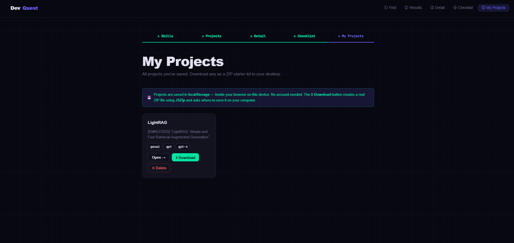

<div align="center">


<br/>

# ⚡ DevQuest — Find Real Projects by Skill

**A browser-native project discovery app powered by the GitHub Search API.**  
Enter your skills → get matched to real GitHub repos → get a full build plan → download a starter ZIP.

<br/>

[](https://developer.mozilla.org/en-US/docs/Web/JavaScript)
[](https://docs.github.com/en/rest/search/search)
[](#)
[](#)
[](#)

<br/>

> 🚀 **Live in 10 seconds** — No npm install. No framework. Open `index.html` with Live Server and go.

</div>

---

## 📸 App Screenshots

### 🏠 Page 1 — Skill Input
> Add your skills as interactive tags. Quick-add presets or type your own. Powered by GitHub Search API.



---

### 📋 Page 2 — Project Results
> 12 real GitHub repos fetched live — sorted by stars, showing language, forks, and topic badges.



---

### 🔍 Page 3 — Project Detail
> Full breakdown of the selected repo: tech stack, stars, forks, language, problem statement, and solution.



> Problem & Solution cards generated from GitHub repo data. Checklist preview shows first 5 tasks.



> Clicking "View on GitHub" opens the real repo — here's Lowdb (22.5k ⭐) as an example result.



---

### ✅ Page 4 — Task Checklist
> 15 tasks auto-generated per project. Progress bar. Every tick saves to localStorage — survives page refresh.



---

### 💾 Page 5 — My Projects
> All saved projects in one place. Open to revisit, Download as ZIP, or Delete.



---

## 🌐 The API — GitHub Search API

> The core of DevQuest. Every project result is a **real GitHub repository**, fetched live.

### How we call it

```js
const url = `https://api.github.com/search/repositories
  ?q=topic:javascript+language:javascript
  &sort=stars
  &order=desc
  &per_page=15`;

const response = await fetch(url, {
  headers: { "Accept": "application/vnd.github.v3+json" }
});

const data = await response.json();
// data.items → array of real matched repos
```

### URL Parameters

| Parameter | Example | What it does |
|-----------|---------|-------------|
| `q=` | `topic:javascript` | Filters repos by GitHub topic tag |
| `language:` | `+language:javascript` | Filters by coding language |
| `sort=` | `stars` | Most starred repos appear first |
| `order=` | `desc` | Highest stars at top |
| `per_page=` | `15` | Returns 15 results per call |

### What the API returns

```json
{
  "total_count": 48291,
  "items": [
    {
      "name": "lowdb",
      "description": "Simple and fast JSON database",
      "language": "JavaScript",
      "stargazers_count": 22500,
      "forks_count": 968,
      "topics": ["javascript", "database", "localstorage", "nodejs"],
      "html_url": "https://github.com/typicode/lowdb"
    }
  ]
}
```

### Why GitHub API?

| ✅ Benefit | Details |
|-----------|---------|
| **Free forever** | No credit card. No subscription. No API key. |
| **No key needed** | Works directly from `fetch()` in the browser |
| **Rate limit** | 10 requests/minute — plenty for normal use |
| **100M+ repos** | Unlimited, always up-to-date real results |
| **Quality filter** | Sort by stars = most tested, best documented projects |
| **Skill matching** | Repos self-tag with topics — we match your skills to those tags |
| **Fallback built-in** | If primary query returns < 3 results, auto-retries with keyword search |

---

## 🗂 File Structure

```
devquest2/
│
├── 📄 index.html        → Page 1: Skill tag input + GitHub API search
├── 📄 results.html      → Page 2: List of 12 matched GitHub repos
├── 📄 detail.html       → Page 3: Full project breakdown
├── 📄 checklist.html    → Page 4: Interactive task checklist
├── 📄 projects.html     → Page 5: Saved projects + ZIP download
│
├── ⚙️  app.js           → ALL JavaScript — 834 lines, powers every page
├── 🎨 style.css         → ALL styling — 554 lines, shared across all pages
│
└── 📁 assets/           → Screenshots used in this README
    ├── page1-landing.png
    ├── page2-results.png
    ├── page3-detail-top.png
    ├── page3-detail-bottom.png
    ├── page3-github.png
    ├── page4-checklist.png
    └── page5-myprojects.png
```

> One `app.js`. One `style.css`. No duplication. No frameworks.

---

## 🧩 Tech Stack

<div align="center">

| Technology | Role in the App | Where used |
|-----------|----------------|-------|
|  **HTML5** | Structure of all 5 pages | All `.html` files |
|  **CSS3** | Dark theme, CSS variables, grid, flex, animations | `style.css` |
|  **Vanilla JS** | All logic — DOM, events, fetch, routing | `app.js` |
|  **GitHub Search API** | Fetches real repos by skill topic tags | `initLanding()` |
| 🗄️ **localStorage** | Saves projects permanently + checklist tick states | All pages |
| 🔄 **sessionStorage** | Passes selected data between pages | All pages |
| 📦 **JSZip** | Creates real ZIP files in the browser — no server | `downloadProjectZip()` |

</div>

---

## 📐 How the App Works — Page by Page

### 🏠 Page 1 — Landing (`index.html`)

User adds skills as interactive tags. Each skill maps to a GitHub topic tag. On click, a `fetch()` call searches the GitHub API live.

```
User types "localStorage" + Enter
        ↓
addSkill() → push to skills[] array
        ↓
renderTags() → creates <span class="skill-tag"> for each skill
        ↓
Click "Search GitHub Projects"
        ↓
buildQuery(skills) → "topic:localstorage + language:javascript"
        ↓
fetch("https://api.github.com/search/repositories?q=...")
        ↓
If < 3 results → auto fallback query retries
        ↓
session("results", data.items) → saves to sessionStorage
        ↓
window.location.href = "results.html"
```

**JS concepts:** `addEventListener('keydown')`, `Array.push()`, `filter()`, `forEach`, `fetch()`, `async/await`, `sessionStorage`

---

### 📋 Page 2 — Results (`results.html`)

Reads fetched repos from `sessionStorage`. Renders each as a clickable card with name, description, language dot, star count, fork count, and topic badges — exactly as seen in the screenshot above.

```
session("results") → reads 12 repos
        ↓
forEach repo → createElement(".project-list-item")
        ↓
Fill: name · description · language color · ★stars · ⑂forks · topic badges
        ↓
User clicks a card
        ↓
session("selectedProject", repo)
        ↓
window.location.href = "detail.html"
```

**JS concepts:** `forEach`, `createElement`, `innerHTML`, `addEventListener('click')`, `sessionStorage`

---

### 🔍 Page 3 — Detail (`detail.html`)

The most information-dense page. Reads the selected project and generates everything from GitHub metadata — tech stack, problem statement, solution, and 15-task build checklist. No extra API call needed.

```
session("selectedProject") → reads chosen repo
        ↓
Fill: title · description · stars · forks · language
Build: tech stack from topics + language (deduplicated with Set)
        ↓
generateProblem(repo)    → problem card text
generateSolution(repo)   → solution card text
generateChecklist(repo)  → 15 tasks based on language + repo
        ↓
session("checklist_tasks", tasks)
session("checklist_project_id", repo.id)
session("checklist_project_name", repo.name)
        ↓
"Save to My Projects" → saveProject(repo, tasks) → localStorage
```

**JS concepts:** `[...new Set()]`, DOM manipulation, `sessionStorage`, `localStorage`

---

### ✅ Page 4 — Checklist (`checklist.html`)

An interactive task list with a progress bar. Every checkbox state saves to localStorage under a unique key per project — so ticks survive page refresh.

```
session("checklist_tasks") → reads tasks array
        ↓
forEach task → <div class="check-item"> + <input type="checkbox">
        ↓
localStorage key: "devquest_check_${projectId}"
Stored as: { "0": true, "3": true, "7": false ... }
        ↓
On checkbox change:
  states[i] = e.target.checked
  localStorage.setItem(key, JSON.stringify(states))
  updateProgress() → recalculates % → updates bar width
```

**JS concepts:** `addEventListener('change')`, `localStorage`, `JSON.stringify/parse`, `Object.values().filter()`

---

### 💾 Page 5 — My Projects (`projects.html`)

Displays all saved projects. Each card has three actions: Open (restores session + navigates to detail), Download (generates ZIP via JSZip), Delete (removes from localStorage array).

```
getSaved() → reads localStorage array
        ↓
forEach saved project → .saved-card with 3 buttons
        ↓
Open →        restore session keys → detail.html
⬇ Download → JSZip → blob → <a>.click() → OS Save dialog
✕ Delete →   filter() → putSaved() → re-render grid
```

**ZIP contains:** `README.md` · `index.html` · `style.css` · `app.js` · `CHECKLIST.txt`

**JS concepts:** `localStorage`, `JSZip`, `URL.createObjectURL()`, `Array.filter()`, `confirm()`

---

## ⚡ Data Flow Between Pages

```
Page 1              Page 2              Page 3              Page 4              Page 5
index.html          results.html        detail.html         checklist.html      projects.html
──────────          ────────────        ───────────         ──────────────      ─────────────
  │                     │                   │                    │                   │
fetch GitHub  ──►  show repo list  ──►  full detail  ──►   checkboxes  ──────► saved grid
  │                     │                   │                    │                   │
session             session             session             localStorage        localStorage
("skills")          ("results")         ("selected          ("devquest_         ("devquest_
("results")         ("selected           Project")           check_ID")          saved_
                     Project")          ("checklist_*")                          projects")
```

> **sessionStorage** — lives only while the tab is open. Used to pass data between pages (temporary).  
> **localStorage** — survives browser restarts. Used for saved projects + checklist tick states (permanent).

---

## 🧠 JavaScript Concepts Used

```javascript
// DOM Manipulation
document.getElementById(), createElement(), appendChild(), innerHTML

// Events
addEventListener('click'), addEventListener('keydown'), addEventListener('change')

// Arrays
forEach(), filter(), find(), map(), push(), some(), slice()

// Objects + Lookup Tables
SKILL_TO_TOPIC = { "html": ["html", "html5"] }   // maps skills to GitHub topics

// Async / Fetch API
async function initLanding() {
  const response = await fetch(githubUrl, { headers });
  const data = await response.json();
}

// Browser Storage
sessionStorage  → page-to-page data passing (temporary)
localStorage    → saved projects + checklist ticks (permanent)
JSON.stringify() / JSON.parse()  → required to store objects as strings

// Programmatic Navigation
window.location.href = "results.html"

// JSZip — Browser ZIP creation
const zip = new JSZip();
zip.folder("project").file("README.md", content);
const blob = await zip.generateAsync({ type: "blob" });
URL.createObjectURL(blob) // → triggers OS Save dialog

// Page Router (no framework needed)
const page = location.pathname.split("/").pop();
if (page === "index.html")    initLanding();
if (page === "results.html")  initResults();
// ...and so on for each page
```

---

## ▶️ Running the Project

**Step 1** — Open VS Code → `File → Open Folder` → select `devquest2`

**Step 2** — Install the **Live Server** extension (search Extensions panel)

**Step 3** — Right-click `index.html` → **Open with Live Server**

**Step 4** — Browser opens at `http://127.0.0.1:5500/index.html` ✅

> ⚠️ Must open `devquest2` — not the old `devquest` folder. Confirm `detail.html` is visible in the Explorer sidebar.

---

## 🔧 Zero Setup Required

| Requirement | Status |
|------------|--------|
| Node.js / npm | ❌ Not needed |
| React / Vue / Angular | ❌ Not used |
| Webpack / Vite / Parcel | ❌ Not needed |
| Backend / Server | ❌ Not needed |
| API Key | ❌ Not required |
| Database | ❌ Uses browser localStorage |
| Internet connection | ✅ Only for GitHub API calls |

---

## 📁 What the ZIP Download Contains

When you click **⬇ Download** on any saved project, JSZip creates the file in browser memory and your OS shows a Save dialog to choose the destination folder.

```
project-name-devquest.zip
└── project-name/
    ├── README.md       ← Project info, GitHub link, tech stack, full checklist
    ├── index.html      ← Starter HTML linked to style.css + app.js
    ├── style.css       ← Dark theme starter with CSS custom properties
    ├── app.js          ← Starter JS with console.log and inline comments
    └── CHECKLIST.txt   ← All 15 tasks numbered, ready to print or share
```

---

## 🤝 Contributing

1. Fork the repo
2. Create a branch: `git checkout -b feature/your-feature`
3. Commit your changes: `git commit -m "Add your feature"`
4. Push: `git push origin feature/your-feature`
5. Open a Pull Request

---

## 📄 License

MIT — use it, modify it, ship it. Just give credit.

---

<div align="center">

**Built with pure Vanilla JavaScript.**  
No frameworks. No npm. No build tools.  
Just HTML, CSS, JS — and one powerful free API.

<br/>

⭐ **Star this repo if it helped you learn!** ⭐

<br/>

*Made by a developer learning in public — one project at a time.*

</div>
