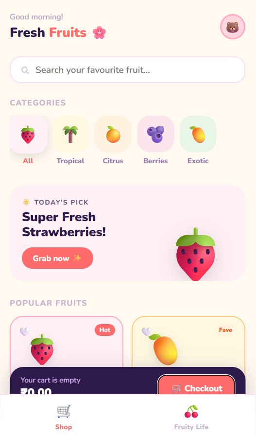
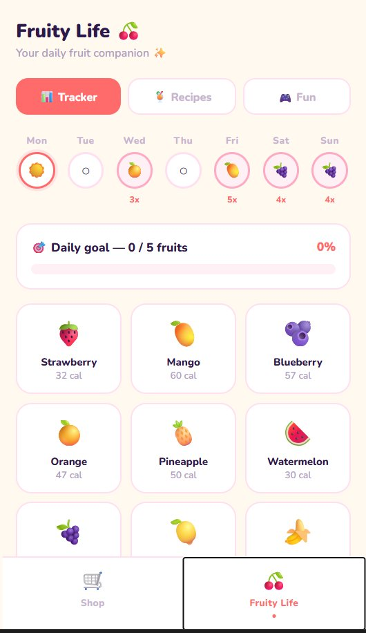
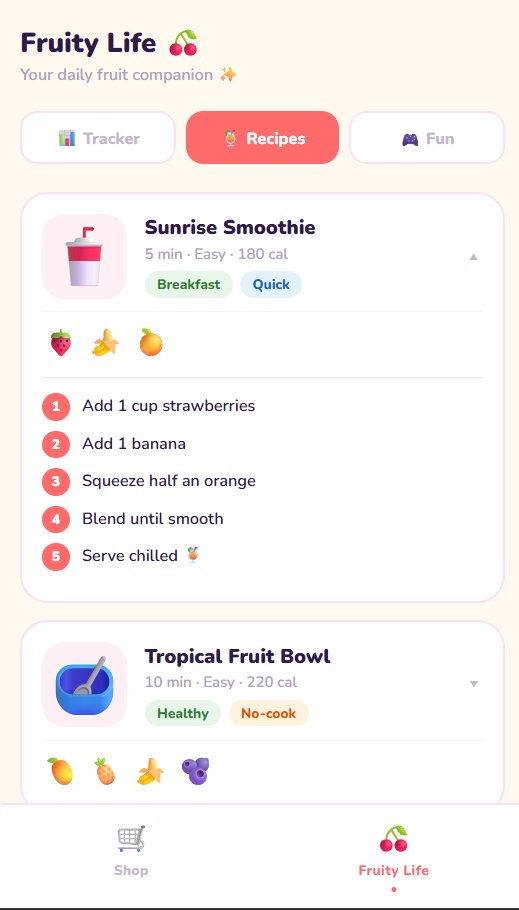
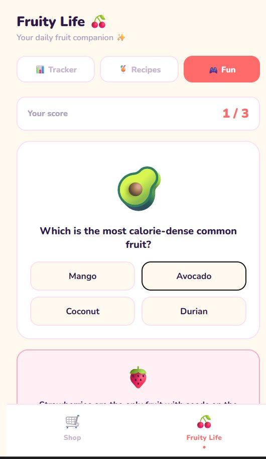
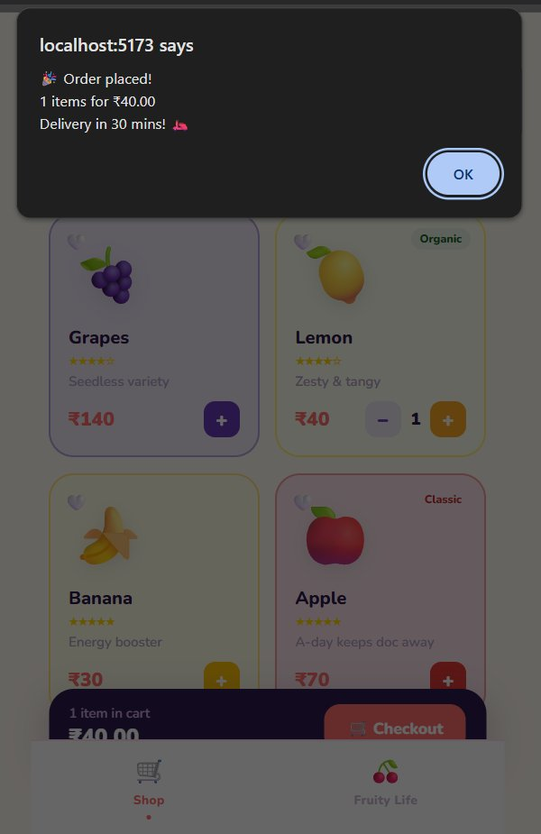

# 🍓 Fruity App

> A cute, mobile-style React fruit app — Shop + Life Tracker in one!

<div align="center">

[](https://react.dev)
[](https://vitejs.dev)
[](LICENSE)
[](https://netlify.com)

</div>

---

## 📸 Screenshots

<div align="center">

| 🛒 Fruit Shop | 📊 Tracker | 🍹 Recipes |
|:---:|:---:|:---:|
|  |  |  |

| 🎮 Fun Quiz | 🛒 Checkout |
|:---:|:---:|
|  |  |

</div>

---

## ✨ Features

### 🛒 Fruit Shop
- 🔍 Search fruits by name or description
- 🏷️ Filter by category — All / Tropical / Citrus / Berries / Exotic
- 🎨 Hero banner changes per active category
- ➕ Add to cart with live +/− quantity controls
- ❤️ Like / unlike your favourite fruits
- 💰 Cart total updates in real time
- 🛵 Checkout with order confirmation popup

### 🍒 Fruity Life

| Tab | What it does |
|-----|-------------|
| 📊 **Tracker** | Select today's fruits, track weekly intake, streak counter 🔥 |
| 🍹 **Recipes** | 5 fruit recipes — tap to expand step-by-step instructions |
| 🎮 **Fun** | 7-question fruit trivia quiz + rotating fun facts |

---

## 🚀 Run Locally

### Prerequisites
Make sure **Node.js 18+** is installed:
```bash
node --version   # should print v18.x.x or higher
```
👉 Download Node.js → https://nodejs.org (pick the **LTS** version)

### Steps

```bash
# 1. Clone the repo
git clone https://github.com/YOUR_USERNAME/fruity-app.git

# 2. Enter the project folder
cd fruity-app

# 3. Install all dependencies (only needed once)
npm install

# 4. Start the development server
npm run dev
```

Open your browser at → **http://localhost:5173** 🎉

> 💡 Hot reload is ON — any code change instantly updates the browser!

---

## 📦 Build for Production

```bash
# Creates an optimized build in the /dist folder
npm run build

# Preview the production build locally
npm run preview
```

---

## 🌐 Deploy to Netlify (Free — Recommended)

### Option A — Drag & Drop (Easiest, no CLI needed)

```
1. Run:  npm run build
2. A /dist folder is created in your project
3. Go to → https://netlify.com  (sign up free)
4. Click "Add new site" → "Deploy manually"
5. Drag your entire /dist folder onto the upload area
6. ✅ Your app is LIVE with a public URL instantly!
```

### Option B — Netlify CLI

```bash
# Install Netlify CLI
npm install -g netlify-cli

# Build the app
npm run build

# Login (opens browser)
netlify login

# Deploy to production
netlify deploy --prod --dir=dist

# Your app goes live at something like:
# https://fruity-app-abc123.netlify.app
```

### Option C — Auto-deploy from GitHub (Best for ongoing updates)

```
1. Push code to GitHub (see GitHub section below)
2. Go to https://netlify.com → "Add new site" → "Import from Git"
3. Connect GitHub → select your fruity-app repo
4. Build settings:
      Build command:    npm run build
      Publish directory: dist
5. Click "Deploy site"
6. Every future git push → auto deploys! 🚀
```

> ⚠️ Fix 404 on page refresh: Create file `public/_redirects` with content:
> ```
> /* /index.html 200
> ```

---

## ☁️ Deploy to Vercel (Alternative — also Free)

```bash
# Install Vercel CLI
npm install -g vercel

# Run from inside the project folder
vercel

# Answer the prompts:
#  → Set up and deploy? Yes
#  → Which scope? your-username
#  → Link to existing project? No
#  → Project name? fruity-app
#  → In which directory? ./  (press Enter)
#  → Override settings? No

# App goes live at:
# https://fruity-app.vercel.app
```

---

## 🐙 Push to GitHub

### Step 1 — Create a new repo on GitHub

```
1. Go to → https://github.com
2. Click "+" (top right) → "New repository"
3. Repository name: fruity-app
4. Set to: ✅ Public
5. ❌ Do NOT check "Add a README file" (we already have one)
6. Click "Create repository"
```

### Step 2 — Initialize git inside your project

```bash
# Make sure you are inside the fruity-app folder first!
cd fruity-app

# Initialize a brand new git repo
git init

# Stage ALL files for the first commit
git add .

# Create your first commit
git commit -m "🍓 Initial commit — Fruity App"
```

### Step 3 — Connect to GitHub and push

```bash
# Connect your local repo to GitHub
# ⚠️ Replace YOUR_USERNAME with your actual GitHub username
git remote add origin https://github.com/YOUR_USERNAME/fruity-app.git

# Rename default branch to "main" (GitHub standard)
git branch -M main

# Push everything to GitHub!
git push -u origin main
```

✅ Your code is now live on GitHub:
`https://github.com/YOUR_USERNAME/fruity-app`

---

### Step 4 — Push future updates

```bash
# After making any changes to the code:

git add .
git commit -m "✨ what you changed (e.g. added new fruit card)"
git push

# If you connected Netlify to GitHub (Option C above),
# this push will also auto-deploy your latest version! 🚀
```

---

### Step 5 — Useful git commands

```bash
git status           # see what files changed
git log --oneline    # see your commit history
git diff             # see exact line-by-line changes
git pull             # pull latest code from GitHub
```

---

## 📁 Project Structure

```
fruity-app/
├── public/
│   └── screenshots/          ← App screenshots (used in README)
│       ├── shop.png
│       ├── tracker.png
│       ├── recipes.png
│       ├── fun.png
│       └── checkout.png
├── src/
│   ├── main.jsx              ← React boot — mounts App into #root
│   ├── App.jsx               ← Root component + bottom nav bar
│   ├── styles/
│   │   └── globals.css       ← Global reset + base styles
│   ├── data/
│   │   └── fruits.js         ← All data: fruits, recipes, quiz, facts
│   └── pages/
│       ├── FruitShop.jsx     ← Page 1: shop with cart + search + filter
│       └── FruityLife.jsx    ← Page 2: tracker + recipes + fun quiz
├── index.html                ← HTML entry point (Vite reads this)
├── package.json              ← Dependencies and npm scripts
├── vite.config.js            ← Vite build config
└── README.md                 ← This file!
```

---

## 🛠️ Tech Stack

| Tool | Version | Purpose |
|------|---------|---------|
| **React** | 18 | UI components, state management |
| **Vite** | 5 | Dev server, hot reload, production build |
| **Nunito (Google Fonts)** | — | Round cute font throughout the app |
| **Inline React styles** | — | No extra CSS libraries needed |

---

## 🐛 Troubleshooting

| Problem | Fix |
|---------|-----|
| `npm install` fails | Ensure Node 18+ is installed: `node --version` |
| Port 5173 busy | Run `npm run dev -- --port 3000` |
| Blank white screen | Press F12 → Console tab → look for red error |
| Fonts not loading | App needs internet to load Google Fonts |
| `git push` asks for password | Use a [GitHub Personal Access Token](https://github.com/settings/tokens) |
| Netlify shows 404 on page refresh | Add `public/_redirects` file with `/* /index.html 200` |
| Vercel build fails | Make sure `npm run build` works locally first |

---

## 📄 License

MIT — free to use, modify, and share! 🍀

---

<div align="center">
Made with 🍓 and React &nbsp;·&nbsp; Built with Vite &nbsp;·&nbsp; Deployed on Netlify
</div>
